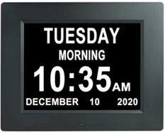
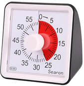
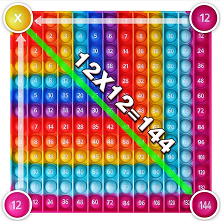

[Back to main](README.md)

# Apps, Products, Stores

:warn: Disclaimer: The following list of products has not undergone review for provenance or authenticity verification. It is provided solely for informational purposes and does not constitute an endorsement or guarantee of the origin or quality of the listed items. Consumers are advised to conduct their own research and due diligence before making any purchasing decisions based on the information presented herein.

## Apps

* [Routinefactory.com](https://routinefactory.com)

## Products

* [Digital Day Clock for Seniors](https://www.amazon.ca/dp/B08N6DLQKJ) 
* [Visual Analog Desktop Timer Countdown Clock](https://www.amazon.ca/Desktop-Countdown-Optional-Classroom-Meeting/dp/B07SKNH7Q6) 
* [12 x 12 Multipication pop it](https://www.amazon.ca/Multipication-Kingmall-Right-Angled-169bubbles-Multiplication/dp/B09K3TX235) 

## Stores

* [Scholars Choice](https://www.scholarschoice.ca/sensory-stimulation.html)

[Back to main](README.md)